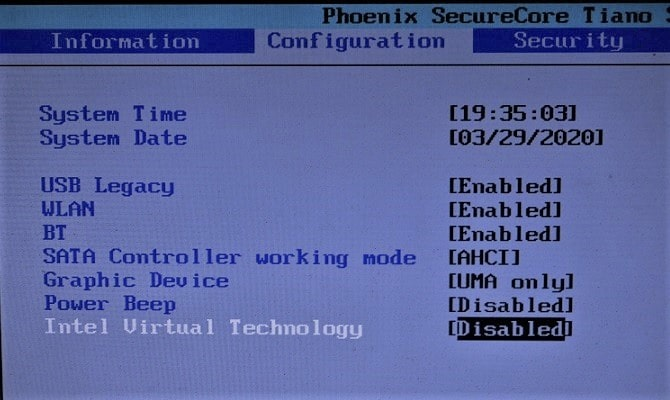
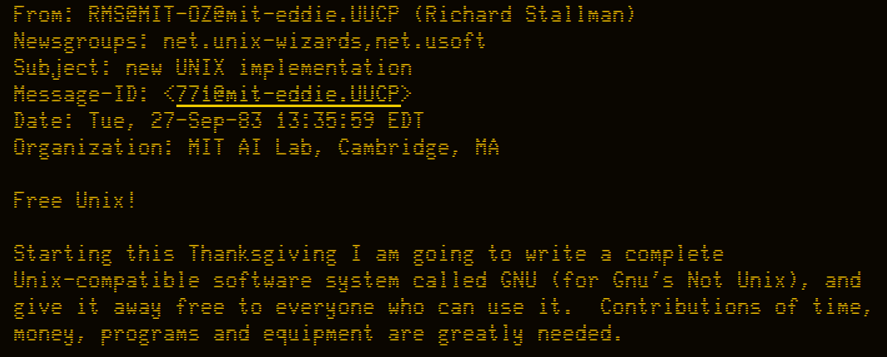
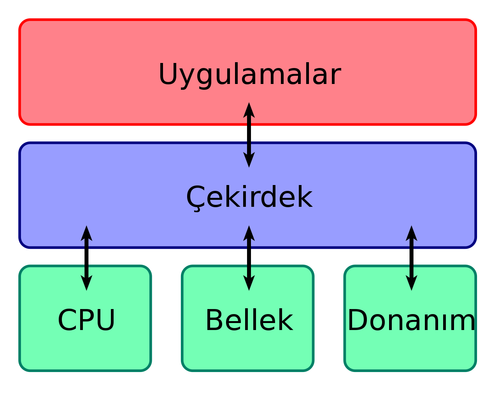
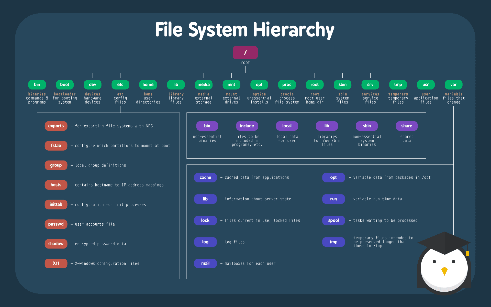

# Temel Linux Egitimi

## Linkler
**Virtual Box - Sanallaştırma uygulaması**
 
https://www.virtualbox.org/wiki/Downloads

Driverlar icin ek paket (Opsiyonel)
https://download.virtualbox.org/virtualbox/6.1.18/Oracle_VM_VirtualBox_Extension_Pack-6.1.18.vbox-extpack

**! Bios sanallastirma ayari acik olmali.**

**Ubuntu Son LTS Surum - Linux Isletim Sistemi**
 
(Derste Ubuntu 20.04 LTS Kullanilacaktir.)

https://ubuntu.com/#download

## Neden Linux

**Özgürlük**
Herhangi bir kısıtlamaya, zorlamaya bağlı olmaksızın düşünme veya davranma, herhangi bir şarta bağlı olmama durumu, serbesti.

* GNU (GNU's Not Unix! 1983)
* FSF (Free Software Foundation 1985)

http://article.olduse.net/771@mit-eddie.UUCP

## Dagitimlar
* Debian, Debian Project
* Pardus, Tubitak
* Ubuntu, Canonical
* Mint, Linux Mint Comunnity
* Raspbian, Raspberry Pi Foundation
* RadHat, RedGat Inc.
* Gentoo, Gentoo Foundation
* Centos, The Community ENTerprise Operating System

https://distrowatch.com/

## Siber Guvenlik
* [Kali Linux](https://www.kali.org/)
* [Parrot OS](https://www.parrotsec.org/)
* [Blackarch](https://blackarch.org/)

## Kisisel Kullanim
* [Ubuntu](https://ubuntu.com/#download)
* [Pop OS](https://pop.system76.com/)
* [Elementary OS](https://elementary.io/)
* [Manjaro Linux](https://manjaro.org/)

## Yavas Eski Bilgisayarlar
* [Lubuntu](https://lubuntu.me/)

   

## Masaustu Ortamlari
* GNOME
* KDE Plasma
* Cinnamon
* MATE
* Xfcee
* LXDE / LXQt
* i3 Window Manager

https://itsfoss.com/best-linux-desktop-environments/

## Debian GNU/Linux 1993
Ozgur bir isletim sistemi yapmaya karar vermis gonullulerin olusturdugu bir isletim sistemidir.

https://www.pardus.org.tr/

## Nasil ogrenirim

Linux yaz kampi

## Linux Uyumlu PC
Dell XPS, Lenovo Thinkpad X ve T serisi, System76 Notebooks

## Kernel

https://www.kernel.org/

https://github.com/torvalds/linux

**Kernel Map**  
https://makelinux.github.io/kernel/map/

## Yocto Project
https://www.yoctoproject.org/

## Ubuntu Desktop Kurulum
* Minimum 2GB Ram
* Gercek Cekirdek Sayisinin Yarisi
* Enable Efi
* Video Memory Max
* Graphics Controller: VboxSVGA
* Enable 3D Acceleration

* arayuz tanitimi.
* uygulamalar ve alternatifleri

## Alternatif Uygulamalar
* Office - Libre Office - Online like google docs.
* Notepad - gedit
* Browser - Firefox - Google Chrome
* Photoshop - Gimp
* Shotcut Video Editor

## Linux File System

## Faydali Linkler

https://itsfoss.com/
https://landscape.cncf.io/
https://www.turnkeylinux.org/