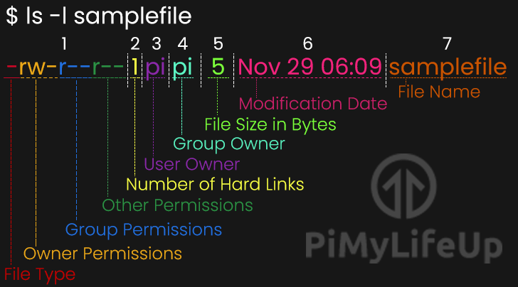
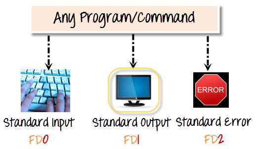

# Shell

Komutlari isleten arac shell (kabuk) olarak nitelendirilir.

## Autocomplete

* use TAB !

## Basic Linux Commands
* ls - listeleme
* cd - mevcut klasoru degistirir
* pwd - mevcut klasor yolunu gosterir
* cat - dosya okuma
* echo - ekrana yazi yazma $PATH
* man - yardim
* which - komut dosyasinin yolunu gosterir
* exit - shell oturumundan cikar
* whoami - kullanici adini yazar
* clear - ekrani temizler

## Klasor Kisayollari
* . Mevcut klasor
* .. Bir ust dizin
* / klasor ayraci

## Klasor Olusturma ve Silme
* mkdir -p klasor
* rmdir -p klasor
* rm -rf klasor

## Dosya olusturma
* touch dosya

* ls ciktisinin anlami.

## Izinler
### Izin Kategorileri
| Symbol | Category |
|--------|----------|
|u|User|
|g|Group|
|o|Other|
|a|All|  

* chmod izin degistirme
* chmod [ugoa] [+-=] [rwx] dosya

## Dosya Okuma
* cat dosya okuma
* more dosya okuma
* less dosya okuma
* head dosya basini okuma
* tail dosya sonunu okuma -f realtime takip
* sort dosya sirali okuma -u tekil -r ters -k2 2. sutuna gore sirala.

## Nano text editor
* nano dosya

## Find
find [konum] -name dosya-adi  -iname DoSYa-AdI 
find [konum] -name *.png -size +1M -size +1G

## Dosya Silme
rm dosya silme
rm -r klasor yineleyerek silme hepsini
rm -f dosya silmeye zorla

## Dosya Kopyalama
cp dosya1 dosya2 kopyalama
cp -r yineleyerek kopyalama
cp dosya1 dosya2 klasor coklu kopyalama
diff dosya1 dosya2 farklarini gosterir
tree klasor yapisini gosterir

## Dosya Tasima ve Isim Degistirme
mv dosya1 dosya2

## Disk Kullanimi
du path -h kb cinsinden goster.

## wildcards
* *.txt
* Tarih*
* \*sinav\*
* ls a*.txt

## Stdin - Stdout - Stderr

## Redirect
* \> yonlendirme ls > asd.txt
* \>> ekleme ls >> asd.txt
* < input sort < asd.txt

## Dosya icinde arama
* grep patern dosya    -v tersini alir. -i case sensitive kaldirir. -n satiri soyler.
* grep nikita asd.txt

## File komutu
* file dosya hakkinda bilgi verir.
* file * dizindeki tum dosyalar hakkinda bilgi verir.
* strings dosya icindeki stringleri cikarir.

## Pipe
* uretilen komutun | ile diger komuta gondermeye saglar.
* ls | wc
* cat file | grep pattern
* cat /etc/passwd | more

## Cut Komutu
* metinleri belli formata gore parcalar ve gosterir.
* cat asd.txt | grep md | cut -d . -f 1
* grep nroot /etc/passwd | cut -d : -f 1,5           1 ve 5
* grep nroot /etc/passwd | cut -d : -f 1-5 | sort    1 den 5 e

## Alias
* alias komut='kosulacak komut.'
* unalias komut kisayolu kaldirir.
* unalias -a hepsini kaldirir.
* kalici olmasi icin `.bash_profile` dosyasina yazilir.

## Ardisil komut
* komut1 && komut2 birinci calisirsa ikinci calisir.
* komut || komut2 birinci calissada calismasada ikinci calisir.

## Ortam Degiskenleri
* printenv
* export YONETICI='Nikita'
* unset YONETICI

## Processler
* ps calisan prosesleri gosterir
* ps -e tum processler
* ps -eH tum processler agac yapisi
* top interaktif process gosterici.

## Klavye kisayollari
* ctrl + c kill
* ctrl + a imlec basa
* ctrl + e imlec sona
* komut & komutu arka planda calistirma
* ctrl + z komutu uyutur ve arka plana koyar
* jobs arkaplanda calisanlar gozukur
* fg arka planda olan komutu on plana getirir
* kill process id kapatir

## Sudo Yonetici komutu
* sudo
* history
* !!  son komut tekrar eder
* !n historydeki herhangi bir komutun satirina gore tekrar calistirir
* tab kullanimi
* update & upgrade
* apt install
* apt remove
* apt-cache madison gimp